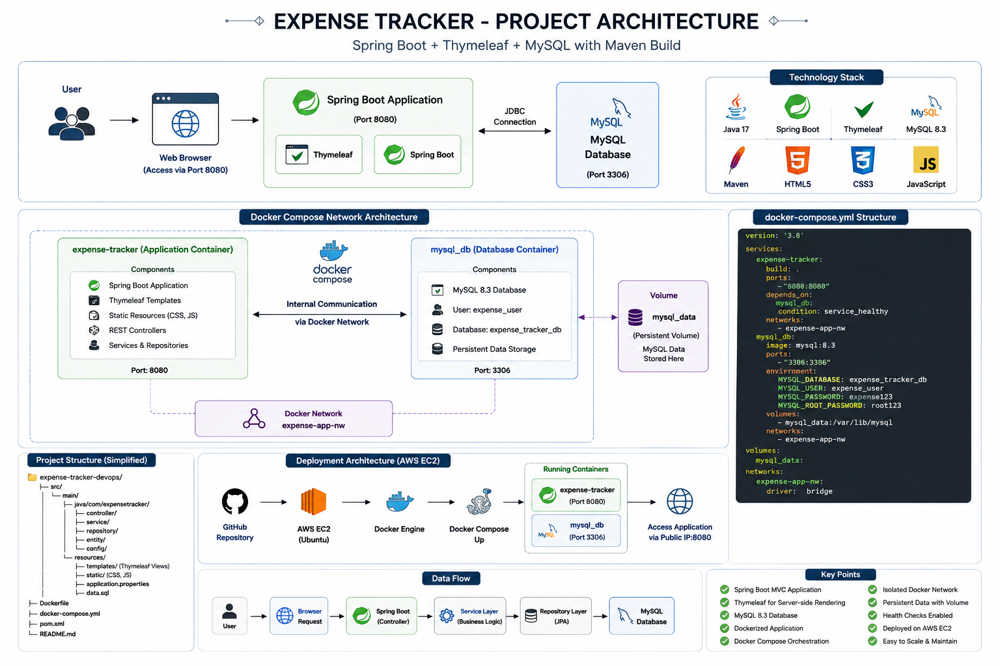
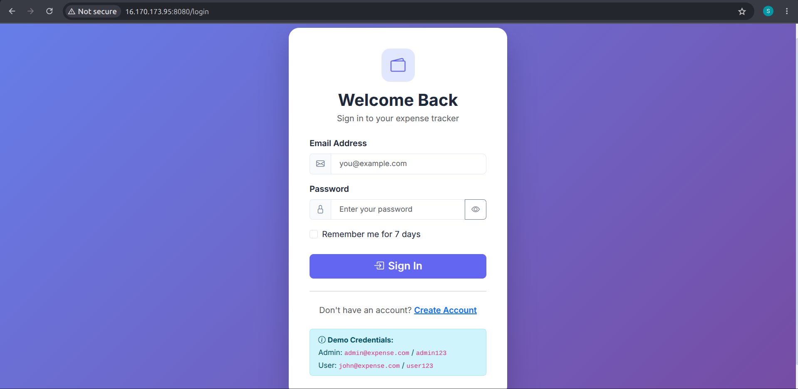
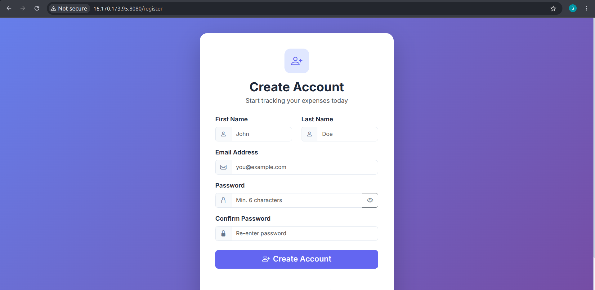
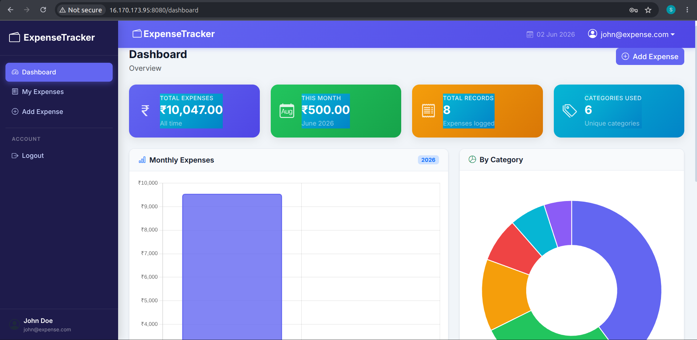
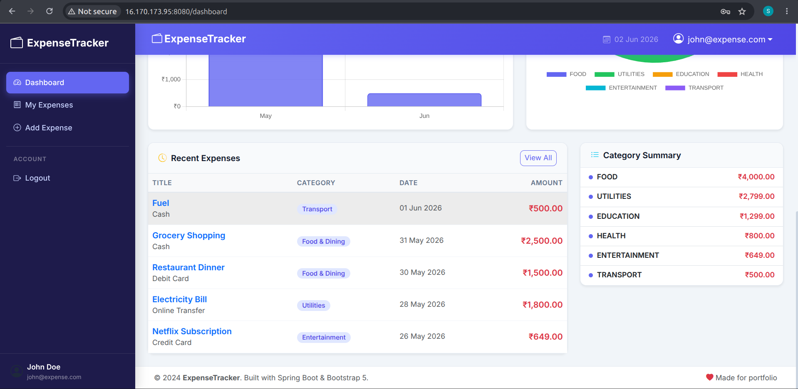
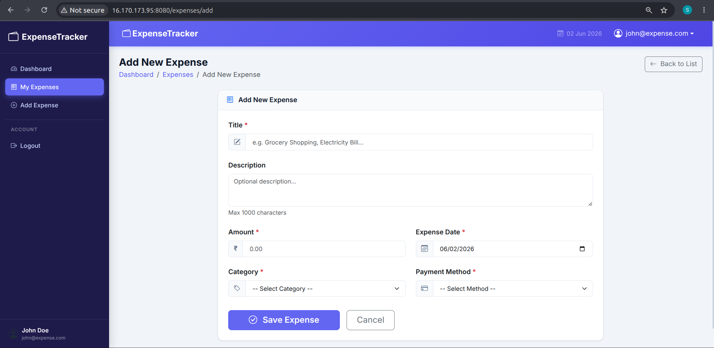
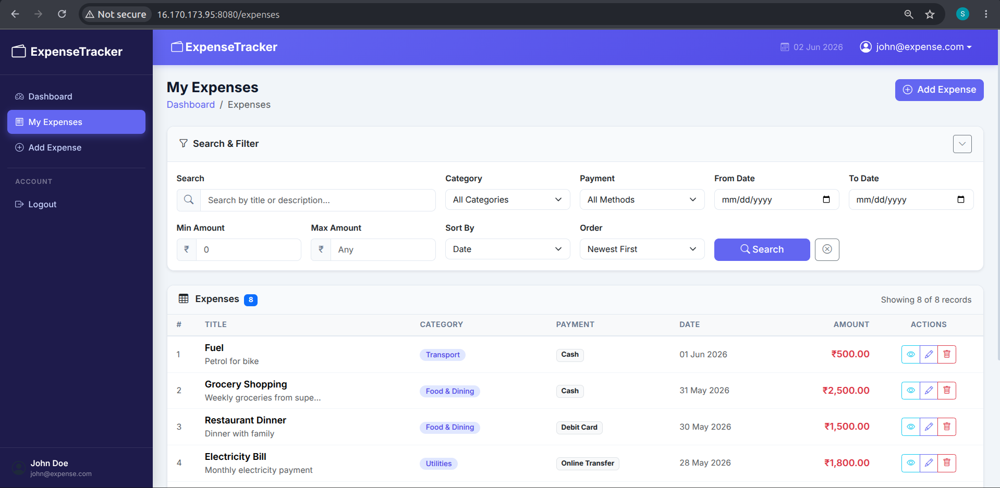

# 💰 Expense Tracker - DevOps Deployment Project

A production-ready Expense Tracker Application built with **Spring Boot, Spring Security, Thymeleaf, MySQL, Docker, Docker Compose, and AWS EC2**.

This project demonstrates complete application containerization, database integration, Docker networking, persistent storage using volumes, and cloud deployment following DevOps best practices.

---

# 🚀 Project Architecture

```text
                           End User
                               │
                               ▼
                     Web Browser / Client
                               │
                               ▼
                     AWS EC2 Public IP
                               │
                               ▼
                    Docker Engine (EC2)
                               │
                               ▼
                        Docker Compose
                               │
         ┌─────────────────────┴─────────────────────┐
         │                                           │
         ▼                                           ▼
 ┌─────────────────┐                     ┌─────────────────┐
 │ Spring Boot App │◄──────────────────►│    MySQL DB     │
 │   (Container)   │    Docker Network  │   (Container)   │
 └─────────────────┘                     └─────────────────┘
         │                                           │
         │                                           ▼
         │                                 Docker Volume
         │                               (Persistent Data)
         ▼
   Thymeleaf Views
   Spring Security
   Business Logic
```

---

# 🏗️ Technology Stack

| Category | Technology |
|-----------|------------|
| Backend | Spring Boot |
| Security | Spring Security |
| Frontend | Thymeleaf |
| Database | MySQL 8 |
| ORM | Spring Data JPA / Hibernate |
| Build Tool | Maven |
| Containerization | Docker |
| Orchestration | Docker Compose |
| Cloud | AWS EC2 |
| Version Control | Git & GitHub |
| Operating System | Ubuntu Linux |

---

# ✨ Features

### Authentication & Security
- User Registration
- User Login & Logout
- Role Based Access Control
- Spring Security Integration
- Session Management

### Expense Management
- Add Expenses
- Update Expenses
- Delete Expenses
- View Expense Details
- Expense Categories
- Payment Methods
- Dashboard Analytics

### DevOps Features
- Multi-stage Docker Build
- Multi-container Architecture
- Docker Networking
- Persistent MySQL Storage
- Environment Variable Configuration
- AWS EC2 Deployment
- Container Health Checks

---

# 📂 Project Structure

```text
expense-tracker-devops/
│
├── Dockerfile
├── docker-compose.yml
├── pom.xml
├── README.md
│
└── src
    └── main
        ├── java
        │   └── com.expensetracker
        │       ├── controller
        │       ├── service
        │       ├── repository
        │       ├── entity
        │       ├── dto
        │       ├── config
        │       ├── exception
        │       └── util
        │
        └── resources
            ├── templates
            ├── static
            ├── application.properties
            └── data.sql
```

---

# 🐳 Docker Architecture

```text
docker-compose
│
├── expense-tracker
│   ├── Spring Boot
│   ├── Thymeleaf
│   ├── Spring Security
│   └── Port 8080
│
└── mysql_db
    ├── MySQL 8
    ├── Port 3306
    └── Persistent Volume
```

### Docker Network

```text
expense-app-nw
│
├── expense-tracker
│
└── mysql_db
```

Both containers communicate internally using the Docker network.

Example:

```text
expense-tracker
      │
      ▼
mysql_db:3306
```

---

# 📦 Clone Repository

```bash
git clone https://github.com/smk233/expense-tracker-devops.git

cd expense-tracker-devops
```

---

# ▶️ Run Application

Build and start all services:

```bash
docker compose up --build -d
```

Verify running containers:

```bash
docker ps
```

---

# ⏹️ Stop Application

```bash
docker compose down
```

---

# 🌍 Access Application

### Local Environment

```text
http://localhost:8080
```

### AWS EC2 Deployment

```text
http://<EC2-PUBLIC-IP>:8080
```

Example:

```text
http://13.233.xxx.xxx:8080
```

---

# ☁️ AWS EC2 Deployment Steps

### 1. Launch Ubuntu EC2 Instance

Open Security Group Ports:

```text
22  -> SSH
8080 -> Spring Boot Application
3306 -> MySQL (Optional)
```

### 2. Install Docker

```bash
sudo apt update

curl -fsSL https://get.docker.com | sudo sh

sudo usermod -aG docker $USER
```

Reconnect SSH.

### 3. Clone Repository

```bash
git clone https://github.com/smk233/expense-tracker-devops.git

cd expense-tracker-devops
```

### 4. Start Containers

```bash
docker compose up --build -d
```

### 5. Verify Deployment

```bash
docker ps
```

### 6. Open Application

```text
http://<EC2-PUBLIC-IP>:8080
```

---

# 📸 Project Screenshots

## Architecture

```markdown

```
## Login Page

```markdown

```

## Registration Page

```markdown

```

## Dashboard 

```markdown


```

## Expense List

```markdown

```

## Add Expenses

```markdown

```

## My Expenses

```markdown

```

---

# 🔧 DevOps Concepts Implemented

- Docker Multi-Stage Build
- Containerization
- Docker Compose
- Container Networking
- Persistent Volumes
- Environment Variable Management
- AWS EC2 Deployment
- Infrastructure Troubleshooting
- Application Monitoring
- Git & GitHub Workflow

---

# 📚 What I Learned

- Deploying Spring Boot applications using Docker.
- Building multi-container applications with Docker Compose.
- Managing MySQL databases inside containers.
- Implementing Docker networking between services.
- Persisting database data using Docker volumes.
- Deploying containerized applications on AWS EC2.
- Troubleshooting real-world Docker and database issues.
- Applying DevOps best practices for deployment and maintenance.

---

# 📄 License

This project is licensed under the **MIT License**.

```text
MIT License

Copyright (c) 2026 Sumit Kumar

Permission is hereby granted, free of charge,
to any person obtaining a copy of this software
and associated documentation files, to deal in
the Software without restriction.
```

---

# 👨‍💻 Author

**Sumit Kumar**

GitHub: https://github.com/smk233

LinkedIn: https://www.linkedin.com/in/sumitsmk

---
